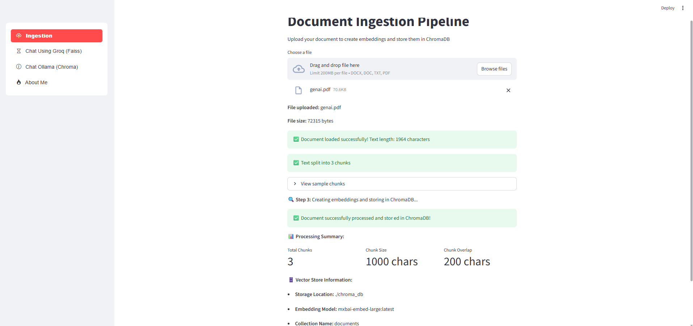
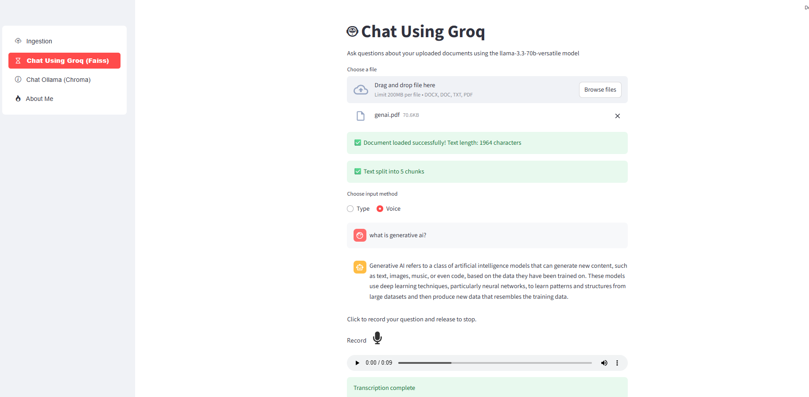
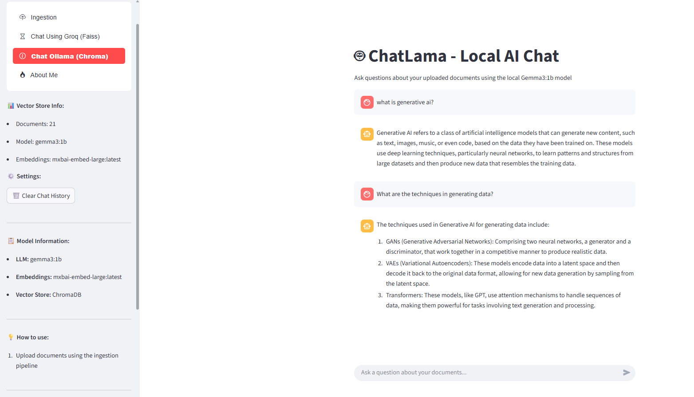
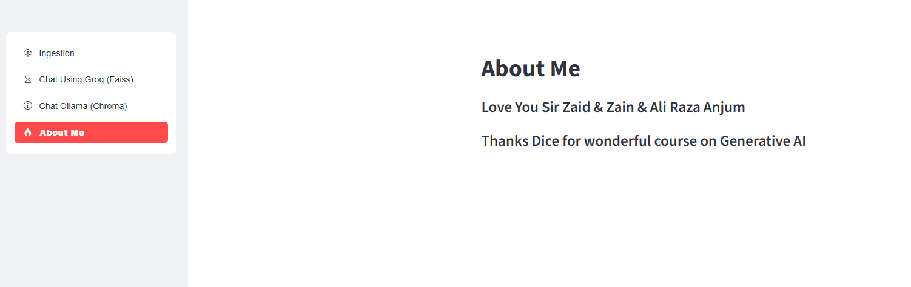

# Generative AI Project Practices – Dice Batch 2 
## Credits: Thanks Sir Zaid, Zain, Ali Raza Anjum & Dice Team 

This project divides the functionality in three sections:

* Develop and ***ChatBot*** Endpoint using ***Streamlit***
* Develop an ***Ingestion Pipeline*** and store the embeddings in ***chroma db***
* Develop an ***Ollama*** powered ***Chatbot Endpoint*** that answers query based on the ***knowledgebase***
    * ***Ollama Model:*** gemma3:1b
    * ***Embedding Model:*** mxbai-embed-large
* Develop and ***Groq*** powered ***Chatbot Endpoint*** that provides following functionalities:
    * Create embeddings using ***FAISS***
    * Answer user inquires based on the ***TEXT*** and ***Audio Input ***
    * Answer user inquiries from ***context*** provided as uploaded document
    * If answer not found in local ***knowledgebase***, use ***function calling*** by invoking an external api to get the required information. 
    * ***Function Calling API*** – Google-Serper-API
    * ***Audio Transcription*** using Eleven Labs API
    * Other Details:
        * ***Groq-Model:*** llama-3.3-70b-versatile
        * ***Groq-Emebdding Model:*** sentence-transformers/all-MiniLM-L6-v2
* ***Format the code*** based on the ***Best Practices*** outlined by Sir Zain.

***Bonus: Video Recording of the project is uploaded on github***

### Ingestion Interfaces

### Chat Using Groq

### Chat Using Ollama

### About Me

